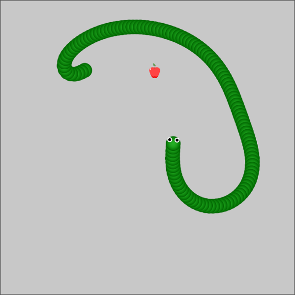
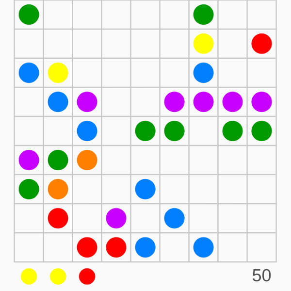

# games
Implementations of various simple online games.

You can play them [here](https://czyzi0.github.io/games/).

## Snake
Simple clone of well known snake game implemented using [p5.js](https://p5js.org/) library.

### Controls
Use arrow keys to move snake and eat as many fruits as you can.

### Screenshots

### Attributions
> [Fruits](https://www.iconfinder.com/iconsets/fruits-8) by [Artem White](https://www.iconfinder.com/ArtWhite), used under [CC BY 3.0](https://creativecommons.org/licenses/by/3.0/)

## SuperBalls
Simple clone of [this](http://www.superkulki.com/balls) game implemented using [p5.js](https://p5js.org/) library.

### Controls
Use mouse to move balls in order to arrange five (or more) of them vertically, horizontally or diagonally.

### Screenshots

## Attributions
> [Dice](https://www.flaticon.com/free-icon/dice_246569) by [Dimi Kazak](https://www.flaticon.com/authors/dimi-kazak)
