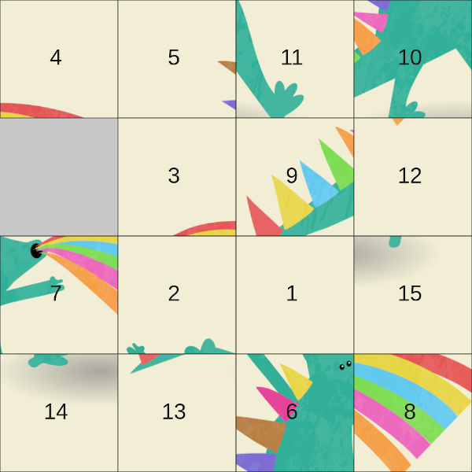
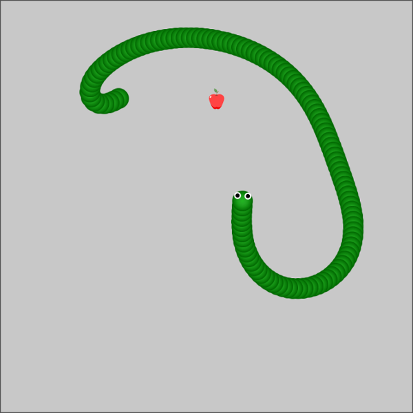
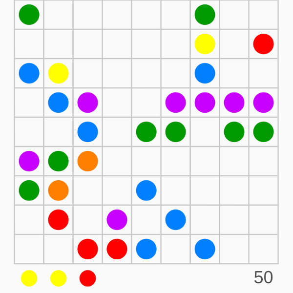

# games
Implementations of various simple online games.

You can play them [here](https://czyzi0.github.io/games/).

## 15Puzzle
Sliding puzzle game implemented using [p5.js](https://p5js.org/) library.

Use mouse to solve the puzzle.

## Snake
Simple clone of well known snake game implemented using [p5.js](https://p5js.org/) library.

Use arrow keys to move snake and eat as many fruits as you can.

## SuperBalls
Simple clone of [this](http://www.superkulki.com/balls) game implemented using [p5.js](https://p5js.org/) library.

Use mouse to move balls in order to arrange five (or more) of them vertically, horizontally or diagonally.

## Attributions
> [Dice](https://www.flaticon.com/free-icon/dice_246569) by [Dimi Kazak](https://www.flaticon.com/authors/dimi-kazak)

> [Fruits](https://www.iconfinder.com/iconsets/fruits-8) by [Artem White](https://www.iconfinder.com/ArtWhite), used under [CC BY 3.0](https://creativecommons.org/licenses/by/3.0/)

> Images from [pixabay](https://pixabay.com/pl/):
> - by [aalmeidah](https://pixabay.com/pl/users/aalmeidah-4277022/)
> - by [AkseniaPopova](https://pixabay.com/pl/users/akseniapopova-14264454/)
> - by [Cdd20](https://pixabay.com/pl/users/cdd20-1193381/)
> - by [Prawny](https://pixabay.com/pl/users/prawny-162579/)
> - by [satheeshsankaran](https://pixabay.com/pl/users/satheeshsankaran-11196627/)
> - by [Saydung89](https://pixabay.com/pl/users/saydung89-18713596/)
